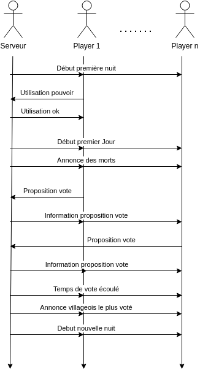
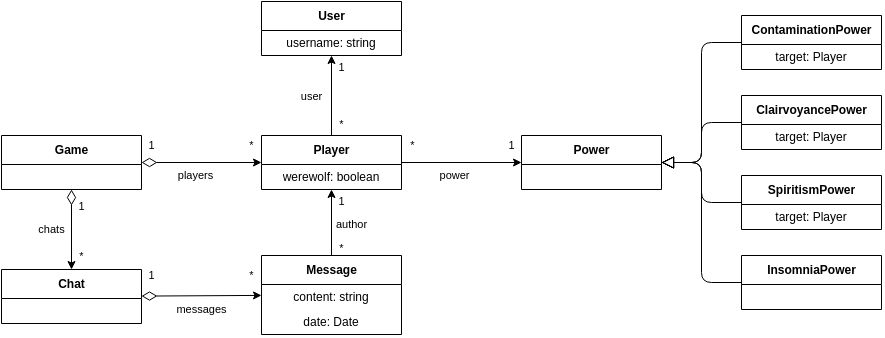

# Rendu pour la partie ACOL

## (a) Analyse

### Description des acteurs

Dans le de notre projet, nous avons défini plusieurs acteurs grâce à la documentation que nous a été fourni.

    

 

- User est l'acteur principal de notre application, c'est lui qui fait les actions du jeu.
- Player représente les personnes physiques qui joue au jeu.
- Server quant à lui un acteur secondaire, il représente notre serveur et les actions qu'il effectue.

### Diagramme de cas d’utilisations

Chaque acteur peut faire différentes actions comme vous pouvez le voir ci-dessous.

    

 

#### Diagrammes de séquences système

Le diagramme Use case étant parfois, pas assez claire, nous avons choisi de faire des diagrammes de séquences systèmes pour certaines parties de notre application.

- Chat

Pré-conditions:
- Le serveur doit etre lancé.
- Les joueurs doivent etre connectés

Post-conditions:
- Les messages sont recus par tout les players

 

    

- Création d'une partie

Pré-conditions:
- Le serveur doit etre lancé.
- Les Users doivent etre connectés

Post-conditions:
- La partie est bien créé

    

- Déroulement d'une partie

Pré-conditions:
- Le serveur doit etre lancé.
- Les Players doivent etre connectés
- La partie doit deja etre créé 

Post-conditions:
- La partie est terminé

    

 

### Diagramme de classes d’analyse

Vous pouvez voir ci-dessous un diagramme de classe d'analyse pour la globalité de notre application.

    

