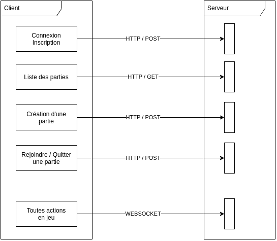
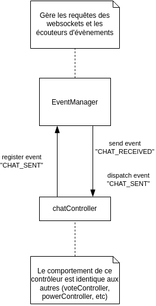

# Rendu pour la partie ACOL

## (a) Analyse

### Description des acteurs

Dans le de notre projet, nous avons défini plusieurs acteurs grâce à la documentation que nous a été fourni.

    

 

- User est l'acteur principal de notre application, c'est lui qui fait les actions du jeu.
- Player représente les personnes physiques qui joue au jeu.
- Server quant à lui un acteur secondaire, il représente notre serveur et les actions qu'il effectue.

### Diagramme de cas d'utilisations

Chaque acteur peut faire différentes actions comme vous pouvez le voir ci-dessous.

    

    

 

#### Diagrammes de séquences système

Le diagramme Use case étant parfois, pas assez claire, nous avons choisi de faire des diagrammes de séquences systèmes pour certaines parties de notre application.

##### Chat

Pré-conditions:

- Le serveur doit etre lancé.
- Les joueurs doivent etre connectés

Post-conditions:

- Les messages sont recus par tout les players

 

    

##### Création d'une partie

Pré-conditions:

- Le serveur doit etre lancé.
- Les Users doivent etre connectés

Post-conditions:

- La partie est bien créé

    

##### Déroulement d'une partie

Pré-conditions:

- Le serveur doit etre lancé.
- Les Players doivent etre connectés
- La partie doit deja etre créé

Post-conditions:

- La partie est terminé

    

 

### Diagramme de classes d’analyse

Vous pouvez voir ci-dessous un diagramme de classe d'analyse pour la globalité de notre application.

    

### Diagramme d'état transition

Nous avons jugé utile d'ajouter un diagramme d'état transition pour la partie client

    

## (b) Conception

### Architecture MVC

Pour ce projet, l'architecture choisie a été le modèle MVC, dont voici l'implémentation :

    

Ce modèle a été appliqué selon les responsabilités de chaque partie (backend et frontend), décrites sur ce schéma :

    

### Conception détaillée

#### Architecture du client

L'application est séparée en "activité" (pages). Voilà un diagramme expliquant la navigation entre les pages

    

#### Diagramme de classes logicielles

Le diagramme de classe logicielles correspondant au serveur est le suivant :

    

#### Communication client-serveur

Pour communiquer entre le client et le serveur, nous avons utilisé 2 technologies : HTTP et Websocket. Voilà comment ces technologies sont réparties dans l'application :

    

#### Fonctionnement détaillés de fonctionnalités

Nous avons utilisé une implémentation basée sur des évènements (une variante du patron de conception observer) pour gérer les actions utilisateurs ainsi que les informations du serveur. Voici des diagrammes expliquant le fonctionnement :

Client :

    

    

Serveur :

    

    

