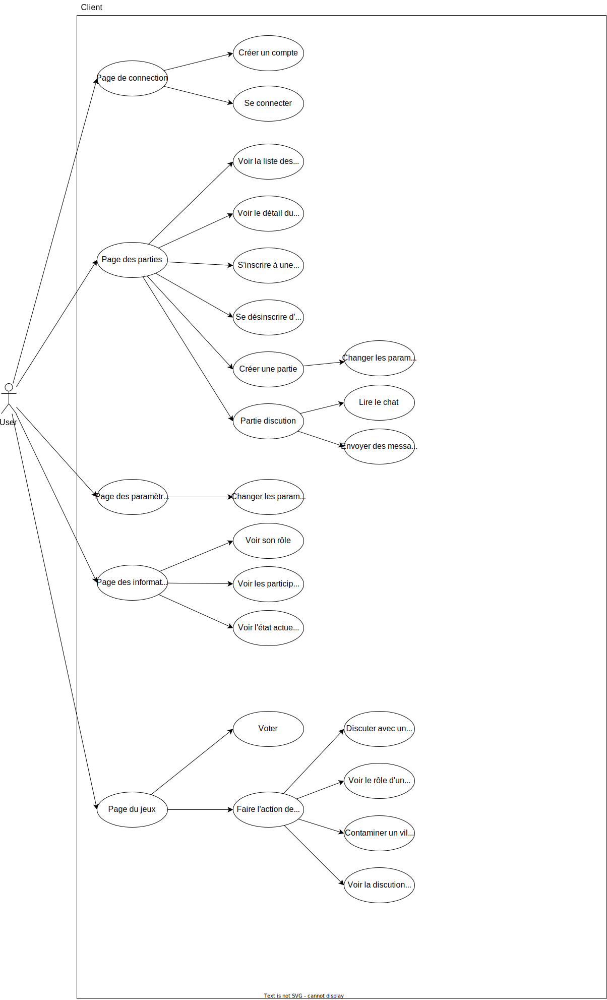

## Installation pour développement

### Dépendances

- Installer en global `npm i -g yarn ts-node expo`
- Installer sur vscode [ESLint](https://marketplace.visualstudio.com/items?itemName=dbaeumer.vscode-eslint), [Prettier](https://marketplace.visualstudio.com/items?itemName=esbenp.prettier-vscode), [Prettier ESLint](https://marketplace.visualstudio.com/items?itemName=rvest.vs-code-prettier-eslint), [TODO Tree](https://marketplace.visualstudio.com/items?itemName=Gruntfuggly.todo-tree)

## (a) Analyse 

### Description des acteurs
    

    

    - User: ce sont les utilisateurs qui interagissent avec le système et jouent au jeu. Ils peuvent créer un compte, rejoindre une partie, effectuer des actions pendant la partie (comme voter ou effectuer des attaques), créer de nouvelles parties, afficher des informations sur le jeu et quitter la partie.

    - Server: c'est le serveur qui gère la logique du jeu et coordonne l'interaction entre les joueurs. Il reçoit et traite les actions du client, met à jour l'état du jeu et envoie des mises à jour d'état à tous les joueurs. Le serveur de jeu gère l'authentification et l'autorisation des joueurs. L’implémentation des protocole HTTP ou WebSocket permettre la communication avec le client.

    - Data base: c'est le composant qui stocke les données du jeu, telles que les informations des joueurs, l'état du jeu e messages.

    - Client: Le client est responsable d'interagir avec l'utilisateur et de gérer l'interface utilisateur pour permettre l'interaction avec le système. En recevant les entrées de l'utilisateur, il les traite et envoie des demandes au serveur pour obtenir des informations ou effectuer des actions dans le système. De plus, le client est responsable de réaliser certaines vérifications basiques de validation des entrées.

### Diagramme de cas d’utilisations

    

