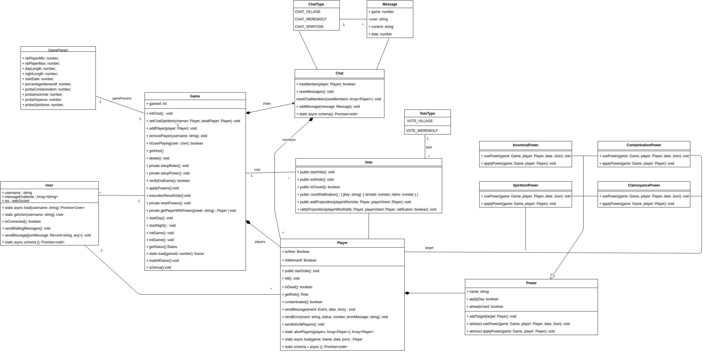

# Présentation du projet

    

  
Le projet consiste a créer le jeux Loup-Garou sur mobile et web. Pour ce faire nous avons crée toute une application avec l'architecture MVC que vous pouvez voir ci-desous.

    

Pour ce projet nous avons utilisé plusieurs technologies:

* React Native
* Yarn
* Expo

* Plusieurs librairies (voir le fichier package.json)

# Documentation pour l’installation et les tests

## Installation pour développement

### Dépendances: 

- Installer en global `npm i -g yarn ts-node expo`
- Installer sur vscode [ESLint](https://marketplace.visualstudio.com/items?itemName=dbaeumer.vscode-eslint), [Prettier](https://marketplace.visualstudio.com/items?itemName=esbenp.prettier-vscode), [Prettier ESLint](https://marketplace.visualstudio.com/items?itemName=rvest.vs-code-prettier-eslint), [TODO Tree](https://marketplace.visualstudio.com/items?itemName=Gruntfuggly.todo-tree)

## (a) Analyse:

### Description des acteurs:
    

    

    - User: Ce sont les utilisateur qui veut créer un compte ou se authentifier dans une compte déjà crée.
    
    - Player: Ce sont les utilisateurs déjà authentifié qui interagissent avec le système et jouent au jeu. Il peuvent rejoindre une partie, effectuer des actions pendant la partie (comme voter ou effectuer des attaques...), créer de nouvelles parties, afficher des informations sur le jeu et quitter la partie.

    - Server: c'est une monolithe que a les attribution de gérer la logique du jeu et coordonne l'interaction entre les joueurs. Il reçoit et traite les actions du client, met à jour l'état du jeu et envoie des mises à jour d'état à tous les joueurs. Le serveur de jeu gère l'authentification et l'autorisation des joueurs. L’implémentation des protocole HTTP ou WebSocket permettre la communication avec le client. Aussi c'est une role du server implémenter la base de donné pour les donné pérenne stockant les données du jeu, telles que les informations des joueurs, l'état du jeu e messages.

### Diagramme de cas d’utilisations:

    

    

### Description de ces cas d’utilisations au travers de diagrammes de séquences système pertinents:

#### Creation de la partie:

    

#### Deroulement de la partie:

    

#### Messages du chat:

    

### Diagramme de classes d’analyse:

    

### Diagramme d’états/transitions si nécessaire:

## Document de conception:

### L’architecture:

    

### Conception détaillée:

- #### Diagramme de classes logicielles:

    

- #### Diagrammes de séquence:

- #### Diagrammes d’états-transitions: