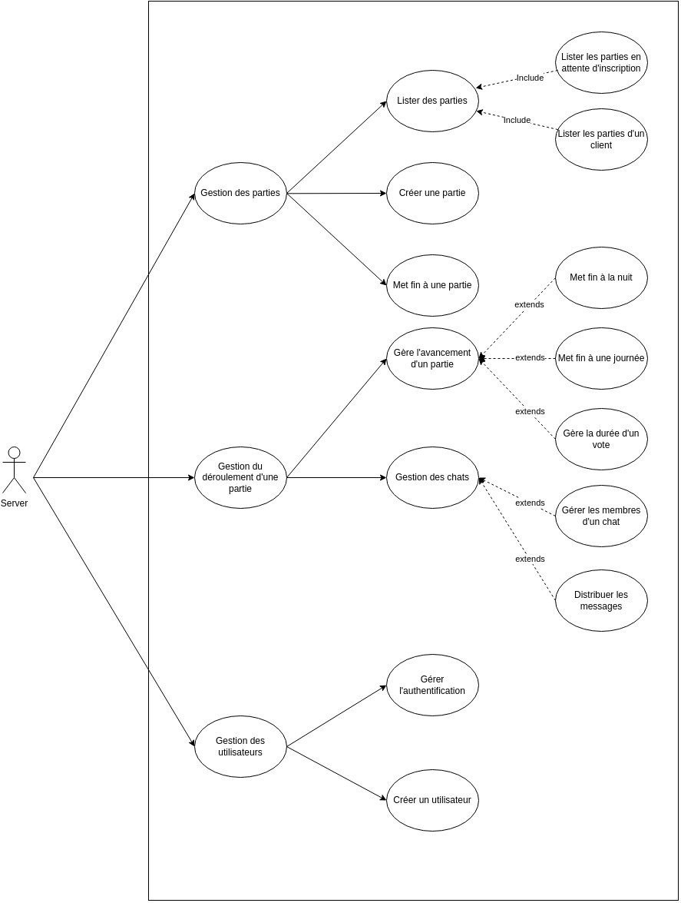
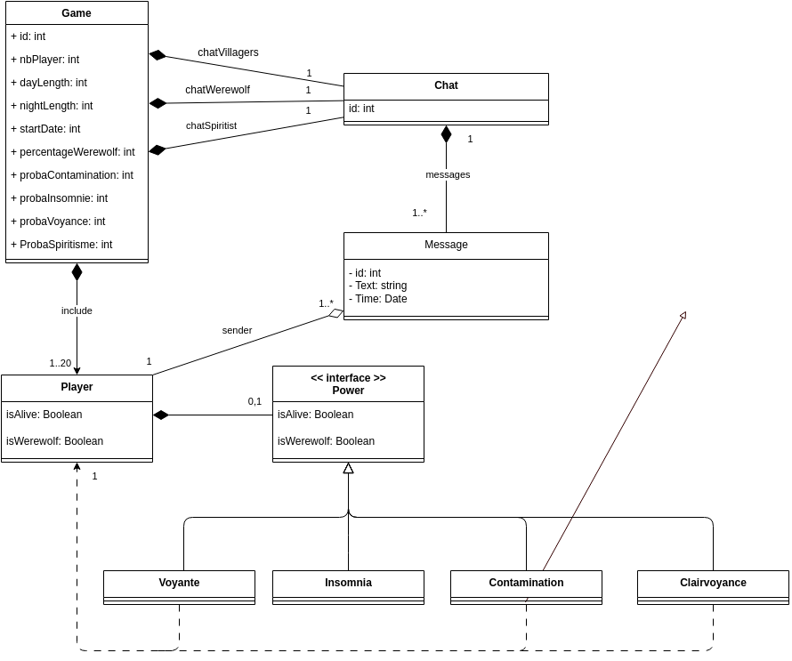

# Présentation du projet
<p align="center">
    
</p>


<br><br>
Le projet consiste à créer le jeu Loup-Garou sur mobile et web. Pour ce faire, nous avons créé toute une application avec l'architecture MVC que vous pouvez voir ci-dessous.


<p align="center">
    
</p>

<br><br>
Pour ce projet, nous avons utilisé plusieurs technologies :

* React Native
* Yarn
* Expo
* Plusieurs librairies (voir le fichier package.json)

# Documentation pour l’installation et les tests

**Cette documentation tient compte que vous avez déjà téléchargé le projet.**

## Installation
Une fois le projet téléchargé, il faut dans un premier temps faire la commande `yarn install` dans le dossier *server/* **et** *client/*

Cette commande va installer toutes les librairies nécessaires au projet.

Une fois cette commande faite, il faut installer certaines librairies globalement avec la commande `npm i -g yarn ts-node expo`


### Frontend
$\textcolor{red}{\text{Attention, la partie frontend doit être lancée après partie backend.}}$ 
<br>

Pour lancer l’application web il vous suffit d’aller dans le dossier *client/* et de faire la commande suivante dans un terminal :
```bash
yarn web
```

Cette commande va ouvrir un nouvel onglet sur votre navigateur par défaut faisant tourner notre site web. 

Cette commande génère aussi un QR Code utilisable pour lancer notre application sur un mobile avec Expo.


### Backend
Pour lancer le serveur (backend), il suffit d’aller dans le dossier *server/* et de faire la commande suivante dans un terminal :
```bash
yarn fix && yarn start
```

La commande `yarn fix` fait les actions suivantes:

  - install / update les paquets
  - supprime la base de données (si elle existe)

La commande `yarn start` quand à elle lance le server


## Test 
### Frontend
Pour effectuer les tests frontend avec cypress, il vous faut dans un premier temps lancer le serveur et le client (voir partie installation). 

Puis dans un second, il faut ouvrir un nouveau terminal dans le dossier *client/* et faire la commande : 
```bash
./node_modules/.bin/cypress run
```

Les tests Cypress E2E testent notre application web jusqu'à la création de parties. Nous ne pouvons pas aller plus loin parce que nous utilisons une librairie pour sélectionner la date et l'heure de début d’une partie et cette librairie n’est pas testable avec Cypress.

### Backend
Pour lancer les tests du backend, il faut : 

Lancer le serveur (voir partie installation).

Puis, lancer les tests dans un nouveau terminal dans le dossier *server/* avec la commande :
```
yarn fix && yarn test
```
La commande `yarn test` lance les tests unitaires du serveur


<br>

# Documentation utilisateur
## Développement du backend

Il est possible d'étendre le jeu du loup-garou et de rajouter des pouvoirs. On peut imaginer des pouvoirs tel que le *\color{black}{Voleur}* qui échange son pouvoir avec quelqu'un d'autres, ou la mise en place de *\color{black}{Cupidon}* qui rend deux personnes amoureuses.  
  
Afin de faciliter le mise en place de ces extensions, le développement du jeu a fait en sorte qu'il suffit de rajouter un fichier dans le répertoire `models/powers/` qui implémente le pouvoir.  
  
Un pouvoir est représenté par une classe qui étends la classe `Power` en donnant les deux informations suivantes :

- le nom du pouvoir
- un booléen qui indique si le pouvoir s'applique immédiatement dans la nuit ou uniquement au début du jour

La classe du pouvoir implément uniquement deux méthodes :

- `applyPower`: permet d'appliquer le pouvoir
- `usePower`: effectuer des vérifications des conditions d'application du pouvoir et appelle `applyPower` uniquement si le pouvoir s'applique immédiatement la nuit.

Enfin, afin qu'un joueur puisse utiliser le pouvoir, il est nécessaire de créer un événement `USE_POWER_POWERNAME` associé à ce pouvoir dans la liste des événements et d'y associer la méthode usePower. Cette tâche se fait facilement avec la ligne de code suivante que l'on place à la fin du fichier, en dehors de la classe :

```ts
Event.registerHandlers("USE_POWER_POWERNAME", usePower);
```

Un dernier point pour ajouter un pouvoir est son initialisation au début de la partie. Pour cela, il suffit d'ajouter dans la classe de votre nouveau pouvoir la méthode `tryAssign` qui prend en paramètre une partie avec la liste des joueurs de cette partie et assigne le nouveau pouvoir en prenant en compte la probabilité d'apparition du pouvoir définit dans les paramètres de la partie et d'autres critères que vous pouvez définir dans cette méthode.  
Enfin, il est nécessaire d'enregistrer le pouvoir dans la liste de tous les pouvoirs avec la ligne de commande suivante que l'on ajoute à la fin du fichier avec l'enregistrement de l'événement associé au pouvoir :

```ts
Power.registerPower(YourNewPower);
```


---
$\textcolor{red}{\text{ANCIEN README A SURPPRIMER}}$ 


## Dépendances: 

- Installer en global `npm i -g yarn ts-node expo`
- Installer sur vscode [ESLint](https://marketplace.visualstudio.com/items?itemName=dbaeumer.vscode-eslint), [Prettier](https://marketplace.visualstudio.com/items?itemName=esbenp.prettier-vscode), [Prettier ESLint](https://marketplace.visualstudio.com/items?itemName=rvest.vs-code-prettier-eslint), [TODO Tree](https://marketplace.visualstudio.com/items?itemName=Gruntfuggly.todo-tree)


## (a) Analyse:

### Description des acteurs:
    
<center>
    
</center>

    - User: Ce sont les utilisateur qui veut créer un compte ou se authentifier dans une compte déjà crée.
    
    - Player: Ce sont les utilisateurs déjà authentifié qui interagissent avec le système et jouent au jeu. Il peuvent rejoindre une partie, effectuer des actions pendant la partie (comme voter ou effectuer des attaques...), créer de nouvelles parties, afficher des informations sur le jeu et quitter la partie.

    - Server: c'est une monolithe que a les attribution de gérer la logique du jeu et coordonne l'interaction entre les joueurs. Il reçoit et traite les actions du client, met à jour l'état du jeu et envoie des mises à jour d'état à tous les joueurs. Le serveur de jeu gère l'authentification et l'autorisation des joueurs. L’implémentation des protocole HTTP ou WebSocket permettre la communication avec le client. Aussi c'est une role du server implémenter la base de donné pour les donné pérenne stockant les données du jeu, telles que les informations des joueurs, l'état du jeu e messages.

### Diagramme de cas d’utilisations:

<center>
    
</center>

<center>
    
</center>


### Description de ces cas d’utilisations au travers de diagrammes de séquences système pertinents:

#### Creation de la partie:

<center>
    
</center>

#### Deroulement de la partie:

<center>
    
</center>

#### Messages du chat:

<center>
    
</center>

### Diagramme de classes d’analyse:

<center>
    
</center>

### Diagramme d’états/transitions si nécessaire:

## Document de conception:

### L’architecture:

<center>
    
</center>


### Conception détaillée:

- #### Diagramme de classes logicielles:

<center>
    
</center>

- #### Diagrammes de séquence:

- #### Diagrammes d’états-transitions: